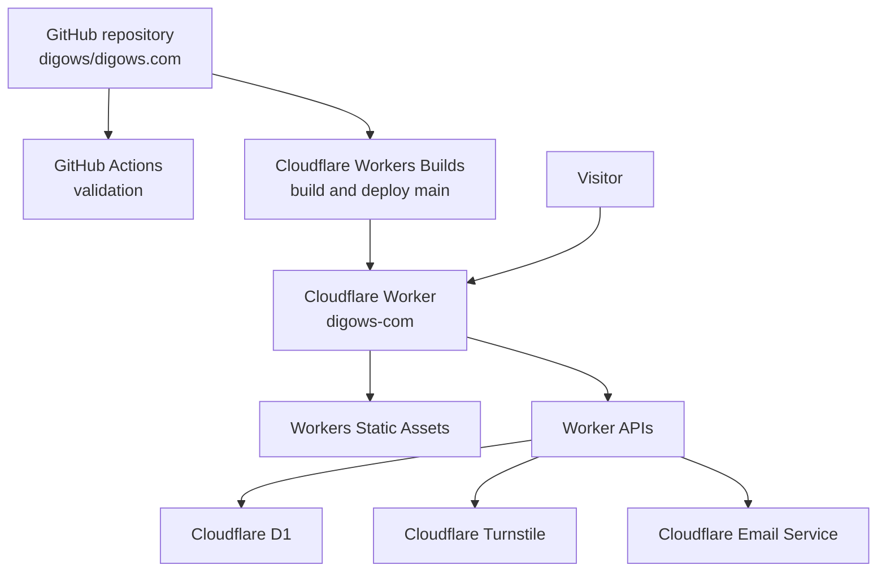

# Architecture and deployment

This document describes the public production architecture of [digows.com](https://digows.com). Private credentials, account identifiers, personal destinations, dashboard links, backup locations, and editorial automation are intentionally outside this repository.

## Topology



The site uses Cloudflare Workers with Static Assets rather than Cloudflare Pages. Static HTML, CSS, JavaScript, images, feeds, and sitemaps are generated by Astro. The Worker runs first for dynamic APIs and redirects; unmatched requests fall through to the static asset binding.

## Sources of truth

| Concern | Source |
| --- | --- |
| Worker, routes, assets, bindings, and non-secret variables | [`wrangler.jsonc`](../wrangler.jsonc) |
| D1 schema | [`migrations/`](../migrations/) |
| Static site and Worker code | [`src/`](../src/) |
| Response security policy | [`public/_headers`](../public/_headers) |
| Continuous validation | [`.github/workflows/ci.yml`](../.github/workflows/ci.yml) |
| Production credentials and private destinations | Cloudflare Worker secrets |
| Git deployment connection | Cloudflare Workers Builds |

The D1 database identifier and Turnstile site key present in versioned configuration are public resource identifiers, not credentials. Turnstile validation, comment fingerprints, moderation signatures, and the notification destination use Worker secrets and must never be committed.

## Runtime APIs

| Route | Methods | Responsibility |
| --- | --- | --- |
| `/api/comments` | `GET`, `POST` | Approved comments and moderated submissions |
| `/api/reactions` | `GET`, `POST` | Anonymous article reactions |
| `/api/contact` | `POST` | Private contact submissions |
| `/moderate/comment` | `GET`, `POST` | Signed moderation confirmation |

The APIs enforce same-origin checks, bounded bodies, Turnstile verification, parameterized D1 access, persistent abuse windows, and structured errors. Logs must not include message bodies, email addresses, tokens, secrets, or raw fingerprints.

## Validation

GitHub Actions validates every pull request and push to `main`:

1. Install dependencies from the lockfile.
2. Verify generated Cloudflare binding types.
3. Type-check Astro and the Worker.
4. Apply all D1 migrations to an isolated local database.
5. Build and audit the static site.
6. Produce a Wrangler deployment dry-run.

Run the same checks locally:

```bash
pnpm install --frozen-lockfile
pnpm run types:check
pnpm run check
pnpm run d1:migrate:local
pnpm run build
pnpm run audit
pnpm exec wrangler deploy --dry-run
```

## Production deployment

Cloudflare Workers Builds follows the `main` branch with repository root `/` and non-production builds disabled.

```text
Build command:  pnpm run types:check && pnpm run check && pnpm run build && pnpm run audit
Deploy command: pnpm run d1:migrate:remote && pnpm exec wrangler deploy
```

The migration command precedes the Worker upload. Production migrations must therefore remain backward-compatible with both the previous and next Worker versions.

Manual deployment is reserved for recovery:

```bash
pnpm run deploy
```

## Secret contract

The Worker requires these production secrets:

- `TURNSTILE_SECRET_KEY`
- `COMMENT_FINGERPRINT_SECRET`
- `COMMENT_MODERATION_SECRET`
- `NOTIFICATION_EMAIL_DESTINATION`

Local development uses `.dev.vars`, copied from `.dev.vars.example` and ignored by Git. Production secrets are set directly in Cloudflare and survive normal Wrangler deployments.

## Data and recovery boundaries

D1 is the source of truth for comments, contact messages, reactions, abuse windows, and stable post localization records. A Worker rollback does not reverse D1 migrations or data changes. Review destructive data operations separately and export production data to an access-controlled location before executing them.
